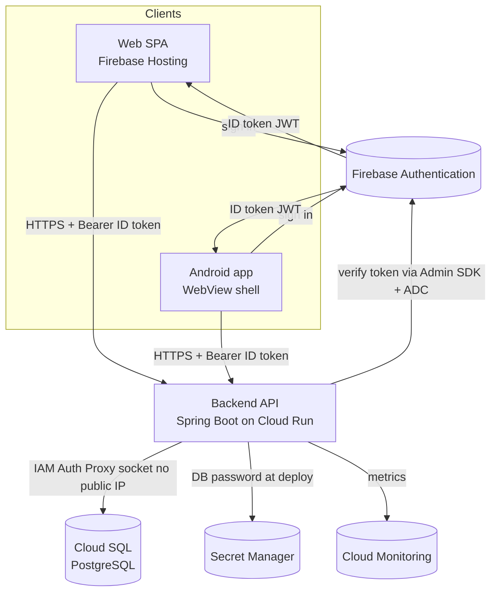

# Architecture

TeamMarhaba is a **multi-surface application**: several client surfaces share one backend API
and one identity provider. This document describes the surfaces, how a request flows end to
end, and how authentication works. Load-bearing technology choices have their own decision
records in [`docs/decisions/`](docs/decisions) (ADRs) — this doc describes the *shape*; the
ADRs capture the *why*.

## Surfaces

| Surface | What it is | Hosted on |
| --- | --- | --- |
| **web** | Single-page web front end | Firebase Hosting (global CDN) |
| **webview** | Shared WebView assets wrapping the web app for the native shells | Bundled into the shells |
| **android** | Native Android app (a shell around the WebView + native bits) | Google Play |
| **backend** | Java 21 / Spring Boot REST API — the single source of truth | Cloud Run (container) |

All clients talk to the **same backend API**; the backend is the only thing that touches the
database. Identity is provided by **Firebase Authentication** and verified by the backend on
every request.

## System diagram

## Request flow

A typical authenticated request, end to end:

1. **Sign in.** The client authenticates with **Firebase Authentication** (email/password or a
   social provider) and receives a Firebase **ID token** — a short-lived signed JWT.
2. **Call the API.** The client calls the backend over HTTPS, sending the ID token as an
   `Authorization: Bearer <token>` header.
3. **Authenticate.** A Spring Security filter extracts the bearer token and verifies it with
   the **Firebase Admin SDK**. Verification uses **Application Default Credentials** (the Cloud
   Run runtime service account) — there is no service-account key in the image. Invalid or
   expired tokens are rejected (default-deny); `/actuator/health` is the only fully public path.
4. **Handle.** The controller/service handles the request. Persistence goes through JPA/
   Hibernate; the schema is owned by **Flyway** migrations (Hibernate only validates).
5. **Reach the database.** The backend connects to **Cloud SQL (PostgreSQL)** through the Cloud
   SQL connector over the **IAM-gated Auth Proxy socket** — no public IP, no host/port, and the
   DB password comes from **Secret Manager** (injected at deploy), never baked into the image.
6. **Respond.** The backend returns JSON. Errors are returned as **RFC 7807 ProblemDetail**
   responses. Request/JVM metrics are exported to **Cloud Monitoring** (prod only).

## Cross-cutting concerns

- **Authentication & authorization** — Firebase ID tokens, verified per request; Spring
  Security is default-deny. See [ADR-0004](docs/decisions/ADR-0004-auth-firebase.md).
- **Configuration** — every required env var is declared in [`.env.example`](.env.example) and
  validated at startup (fail-loud, no silent defaults). Secrets come from Secret Manager.
- **Schema** — versioned Flyway migrations, applied on startup; Hibernate is `validate`-only.
- **Observability** — Actuator health/info/metrics; Micrometer → Cloud Monitoring in prod;
  structured JSON logging.
- **CI/CD** — PRs run build + tests; merges to `main` build an image (Artifact Registry) and
  deploy to Cloud Run, all via keyless Workload Identity Federation (no JSON keys). Actions are
  SHA-pinned and each build emits a CycloneDX SBOM (see [`docs/supply-chain.md`](docs/supply-chain.md)).

## Decision records

The load-bearing choices behind this architecture:

- [ADR-0001](docs/decisions/ADR-0001-gradle-build-standard.md) — Gradle (Kotlin DSL) as the
  backend build tool *(decision recorded; conversion happens on the planned redo — the current
  backend still builds with Maven)*.
- [ADR-0002](docs/decisions/ADR-0002-database-cloud-sql.md) — Cloud SQL (PostgreSQL) datastore.
- [ADR-0003](docs/decisions/ADR-0003-hosting-cloud-run-firebase.md) — Cloud Run + Firebase Hosting.
- [ADR-0004](docs/decisions/ADR-0004-auth-firebase.md) — Firebase Authentication.
