# Epic 1 — Dependency DAG & execution order

Dependency graph for the 36 active Foundation Tasks. Arrows point **blocker → blocked** (work flows downward). Roots are at the top; depth = `wave-N` label.

> **Updated 2026-06-20:** **TM-47** (1.1.4 template bootstrap) **dropped** (no fork/template model); **TM-80** (1.1.6 *seed agent operating instructions into the repo*) **added**, blocked by TM-44. **`TM-44 → TM-80` is the inline linear bootstrap** — create repo, then seed the agent rules into it — which primes the repo before the parallel agents self-host (see `AGENT-CLAIM-PROTOCOL.md` → Prerequisite).

## DAG

```mermaid
graph TD
  classDef root fill:#bbf7d0,stroke:#16a34a,stroke-width:2px;
  classDef hub fill:#fde68a,stroke:#d97706,stroke-width:2px;

  TM44["1.1.1 · TM-44<br/>mono-repo"]:::root
  TM66["1.5.1 · TM-66<br/>GCP project"]:::root
  TM49["1.2.1 · TM-49<br/>walking skeleton"]:::hub
  TM50["1.2.2 · TM-50<br/>backend Dockerfile"]:::hub
  TM45["1.1.2 · TM-45 branch protect"]
  TM46["1.1.3 · TM-46 repo hygiene"]
  TM80["1.1.6 · TM-80 seed agent rules"]
  TM48["1.1.5 · TM-48 ADRs/docs"]
  TM51["1.2.3 · TM-51 web Dockerfile"]
  TM52["1.2.4 · TM-52 compose"]
  TM53["1.3.1 · TM-53 PR CI"]
  TM54["1.3.2 · TM-54 coverage gate"]
  TM55["1.3.3 · TM-55 image push"]
  TM56["1.3.4 · TM-56 CodeQL/dep"]
  TM57["1.3.5 · TM-57 Testcontainers"]
  TM58["1.3.6 · TM-58 secret scan"]
  TM59["1.3.7 · TM-59 SBOM/pin"]
  TM60["1.4.1 · TM-60 deploy backend"]
  TM61["1.4.2 · TM-61 deploy web"]
  TM62["1.4.3 · TM-62 secrets/env"]
  TM63["1.4.4 · TM-63 Cloud SQL"]
  TM64["1.4.5 · TM-64 fail-loud"]
  TM65["1.4.6 · TM-65 PR previews"]
  TM67["1.5.2 · TM-67 OIDC"]
  TM68["1.5.3 · TM-68 lint/hooks"]
  TM69["1.5.4 · TM-69 cmd runner"]
  TM70["1.6.1 · TM-70 profiles"]
  TM71["1.6.2 · TM-71 Flyway"]
  TM72["1.6.3 · TM-72 error model"]
  TM73["1.6.4 · TM-73 JSON logs"]
  TM74["1.6.5 · TM-74 Actuator"]
  TM75["1.6.6 · TM-75 metrics"]
  TM76["1.6.7 · TM-76 OpenAPI"]
  TM77["1.6.8 · TM-77 /api/v1"]
  TM78["1.6.9 · TM-78 sec headers"]
  TM79["1.6.10 · TM-79 Firebase Auth"]

  TM44 --> TM45 & TM46 & TM48 & TM49 & TM51 & TM58 & TM69 & TM80
  TM49 --> TM50 & TM53 & TM68 & TM70 & TM72 & TM73 & TM74 & TM76 & TM77 & TM78 & TM79
  TM50 --> TM52 & TM55
  TM51 --> TM52 & TM61
  TM53 --> TM54 & TM56 & TM57 & TM59
  TM54 --> TM45
  TM55 --> TM59 & TM60
  TM66 --> TM63 & TM67 & TM79
  TM67 --> TM55 & TM60 & TM61
  TM63 --> TM60 & TM62
  TM60 --> TM62 & TM65
  TM62 --> TM64
  TM70 --> TM57 & TM64 & TM71 & TM73
  TM71 --> TM57
  TM52 --> TM69 & TM71
  TM61 --> TM65
  TM74 --> TM75 & TM79
```

## "Blocks the most" — leverage leaderboard

How many tasks each one ultimately unblocks (transitive descendants). The two **roots** (zero blockers) lead.

| Rank | Task | Unblocks | Root? |
|---|---|--:|:--:|
| 1 | **TM-44** 1.1.1 mono-repo | **32** | ✅ root |
| 2 | TM-49 1.2.1 walking skeleton | 25 | |
| 3 | **TM-66** 1.5.1 GCP project | **10** | ✅ root |
| 3 | TM-50 1.2.2 backend Dockerfile | 10 | |
| 5 | TM-67 1.5.2 OIDC | 7 | |
| 6 | TM-51 1.2.3 web Dockerfile | 6 | |
| 7 | TM-53 1.3.1 PR CI · TM-55 1.3.3 image push | 5 | |
| 9 | TM-70 1.6.1 profiles · TM-63 1.4.4 Cloud SQL | 4 | |

> Start the **two roots** (`TM-44`, `TM-66`) — they're blocked by nothing and unblock 32 and 10 tasks. `TM-49` and `TM-50` aren't roots (they sit under `TM-44`) but are the next-highest-leverage, so they're the priority the moment they're ready.

## Recommended execution order (priority topological sort)

Rule: **roots that block the most first**, then proceed by **fewest blockers (readiest) first**, breaking ties by leverage. Every task appears only after all its blockers. For a single worker, go top to bottom; with N agents, anything whose blockers are all done can run in parallel.

| # | Task | Wave | Blocked by |
|--:|---|:--:|---|
| 1 | **TM-44** 1.1.1 mono-repo | 0 | — |
| 2 | **TM-66** 1.5.1 GCP project | 0 | — |
| 3 | TM-49 1.2.1 walking skeleton | 1 | 44 |
| 4 | TM-67 1.5.2 OIDC | 1 | 66 |
| 5 | TM-51 1.2.3 web Dockerfile | 1 | 44 |
| 6 | TM-63 1.4.4 Cloud SQL | 1 | 66 |
| 7 | TM-46 1.1.3 repo hygiene | 1 | 44 |
| 8 | TM-80 1.1.6 seed agent rules (inline bootstrap — do right after the repo) | 1 | 44 |
| 9 | TM-48 1.1.5 ADRs/docs | 1 | 44 |
| 10 | TM-58 1.3.6 secret scan | 1 | 44 |
| 11 | TM-50 1.2.2 backend Dockerfile | 2 | 49 |
| 12 | TM-53 1.3.1 PR CI | 2 | 49 |
| 13 | TM-70 1.6.1 profiles | 2 | 49 |
| 14 | TM-74 1.6.5 Actuator | 2 | 49 |
| 15 | TM-61 1.4.2 deploy web | 2 | 51, 67 |
| 16 | TM-68 1.5.3 lint/hooks | 2 | 49 |
| 17 | TM-72 1.6.3 error model | 2 | 49 |
| 18 | TM-76 1.6.7 OpenAPI | 2 | 49 |
| 19 | TM-77 1.6.8 /api/v1 | 2 | 49 |
| 20 | TM-78 1.6.9 sec headers | 2 | 49 |
| 21 | TM-55 1.3.3 image push | 3 | 50, 67 |
| 22 | TM-52 1.2.4 compose | 3 | 50, 51 |
| 23 | TM-54 1.3.2 coverage gate | 3 | 53 |
| 24 | TM-56 1.3.4 CodeQL/dep | 3 | 53 |
| 25 | TM-73 1.6.4 JSON logs | 3 | 70, 49 |
| 26 | TM-75 1.6.6 metrics | 3 | 74 |
| 27 | TM-79 1.6.10 Firebase Auth | 3 | 49, 74, 66 |
| 28 | TM-60 1.4.1 deploy backend | 4 | 55, 63, 67 |
| 29 | TM-71 1.6.2 Flyway | 4 | 70, 52 |
| 30 | TM-45 1.1.2 branch protection | 4 | 44, 54 |
| 31 | TM-59 1.3.7 SBOM/pin | 4 | 53, 55 |
| 32 | TM-69 1.5.4 cmd runner | 4 | 44, 52 |
| 33 | TM-62 1.4.3 secrets/env | 5 | 60, 63 |
| 34 | TM-57 1.3.5 Testcontainers | 5 | 53, 70, 71 |
| 35 | TM-65 1.4.6 PR previews | 5 | 60, 61 |
| 36 | TM-64 1.4.5 fail-loud secrets | 6 | 70, 62 |

## Critical path (longest chain = minimum makespan)

Even with unlimited agents, the project can't finish faster than this 7-deep chain:

**TM-44 (1.1.1) → TM-49 (1.2.1) → TM-50 (1.2.2) → TM-55 (1.3.3) → TM-60 (1.4.1) → TM-62 (1.4.3) → TM-64 (1.4.5)**

So: 7 sequential ticket-completions is the floor. Protect this chain — a delay on any of these 7 delays the whole epic.
