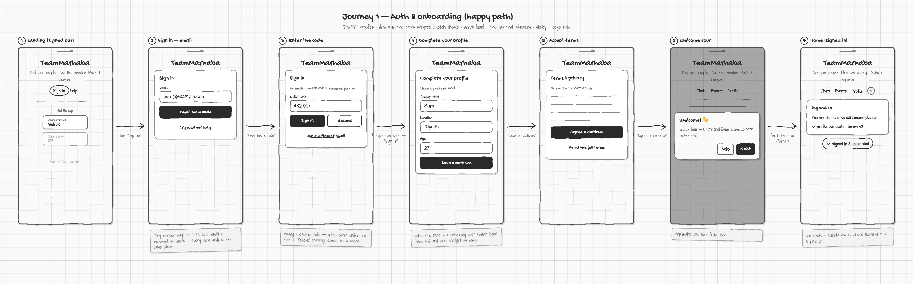

# Wireflow — Journey 1: Auth & onboarding

Happy path from a signed-out visitor to a signed-in, onboarded user on Home. Rendered with the
app's shipped Sketch theme (see [`index.md`](./index.md) for how) from [`auth.html`](./auth.html).



## Flow

```mermaid
flowchart LR
    L[1 Landing signed-out] -->|tap "Sign in"| E[2 Sign in — email]
    E -->|"Email me a code"| C[3 Enter the 6-digit code]
    C -->|type code → "Sign in"| P[4 Complete your profile]
    P -->|"Save & continue"| T[5 Accept terms]
    T -->|"Agree & continue"| W[6 Welcome tour]
    W -->|finish tour| H[7 Home signed-in]
```

## Screens

| # | Screen | What's on it | Advances by |
| --- | --- | --- | --- |
| 1 | Landing (signed out) | App shell: logo, tagline, `Sign in`/`Help` nav, "Get the app" badges, build stamp | tap **Sign in** |
| 2 | Sign in — email | The passwordless front door (TM-234): email field, **Email me a code**, `Try another way` disclosure | **Email me a code** |
| 3 | Enter the code | "We emailed a 6-digit code to …", code field, **Sign in** / Resend | type code → **Sign in** |
| 4 | Complete your profile | First-login gate (TM-250): display name, location, age | **Save & continue** |
| 5 | Accept terms | Terms gate (TM-170): version + summary, **Agree & continue** | **Agree & continue** |
| 6 | Welcome tour | First-run walkthrough (TM-135) as a dimmed overlay + coachmark dialog | finish the tour |
| 7 | Home (signed in) | Signed-in card, avatar in nav, `Chats`/`Events` entry points | — (end) |

## Edge notes (annotated inline on the frames)

- **Screen 2** — `Try another way` reveals SMS code, email + password, and Google; every
  alternative lands in the same place (screen 4 for a first login, Home for a returning user).
- **Screen 3** — wrong/expired code → inline error under the field + `Resend`; the flow never
  leaves the screen.
- **Screens 4–6** — the gates fire once. A returning user (warm login / session restore) skips
  straight from 3 to 7.
- **Screen 6** — the tour is replayable any time from Help.
