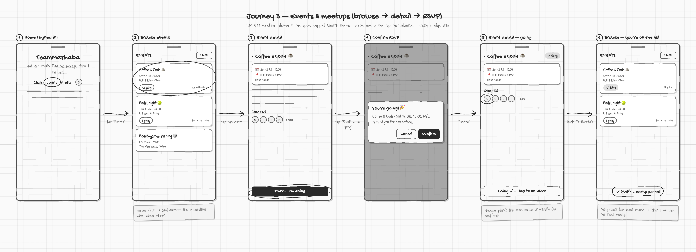

# Wireflow — Journey 3: Events & meetups

Happy path for the meetup core: browse events → event detail → RSVP → confirmed. Rendered with
the app's shipped Sketch theme (see [`index.md`](./index.md)) from [`events.html`](./events.html).



## Flow

```mermaid
flowchart LR
    H[1 Home] -->|tap "Events"| B[2 Browse events]
    B -->|tap an event| D[3 Event detail]
    D -->|"RSVP — I'm going"| C[4 Confirm RSVP]
    C -->|"Confirm"| G[5 Detail — going]
    G -->|back| B2[6 Browse — you're on the list]
```

## Screens

| # | Screen | What's on it | Advances by |
| --- | --- | --- | --- |
| 1 | Home (signed in) | Nav with `Events` entry point | tap **Events** |
| 2 | Browse events | Cards soonest-first: title, date/time, place, going-count, host; `+ New` | tap an event card |
| 3 | Event detail | When/where/host, description, attendee avatars, **RSVP — I'm going** | tap **RSVP** |
| 4 | Confirm RSVP | Dialog over the detail: event + time recap, **Confirm** / Cancel | **Confirm** |
| 5 | Detail — going | `✓ Going` badge, count 12 → 13, your avatar on the list, button flips to un-RSVP | back |
| 6 | Browse — on the list | Your event card now carries `✓ Going` | — (end) |

## Edge notes (annotated inline on the frames)

- **Screen 5** — changed plans? The same button un-RSVPs; no dead end.
- **Screen 2** — a card answers the three decisions at a glance: what, when, where.
- **Screen 6** — closes the product loop: meet people → chat 1:1 (journey 2) → plan the next
  meetup.
