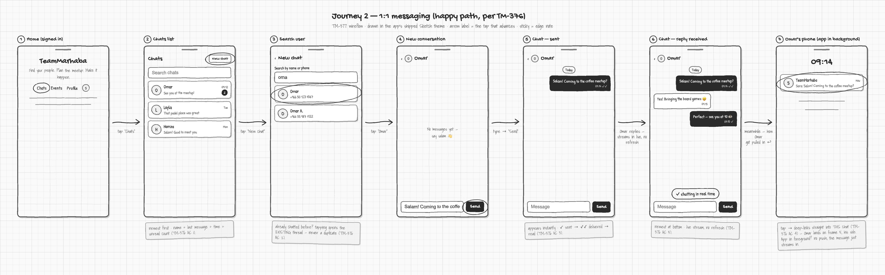

# Wireflow — Journey 2: 1:1 messaging

Happy path for WhatsApp-style direct messaging, aligned with [TM-376]'s concept and ACs
(chats list → search user → new chat → send with ✓/✓✓ → live reply → push notification).
Rendered with the app's shipped Sketch theme (see [`index.md`](./index.md)) from
[`messaging.html`](./messaging.html).



## Flow

```mermaid
flowchart LR
    H[1 Home] -->|tap "Chats"| CL[2 Chats list]
    CL -->|tap "New chat"| S[3 Search user]
    S -->|tap a result| N[4 New conversation]
    N -->|type → "Send"| SE[5 Chat — sent ✓✓]
    SE -->|reply streams in live| R[6 Chat — reply received]
    R -.->|meanwhile, recipient side| P[7 Push notification]
    P -.->|tap → deep-link| SE
```

## Screens

| # | Screen | What's on it | Advances by |
| --- | --- | --- | --- |
| 1 | Home (signed in) | Nav with `Chats` entry point | tap **Chats** |
| 2 | Chats list | Conversations newest-first: avatar, name, last message, time, unread count (TM-376 AC 1); search; **New chat** | tap **New chat** |
| 3 | Search user | Search by name or phone; result rows with number | tap a result |
| 4 | New conversation | Empty thread ("no messages yet"), composer | type → **Send** |
| 5 | Chat — sent | Bubble appears instantly, right-aligned, with ✓ sent → ✓✓ delivered → read (AC 3) | recipient replies |
| 6 | Chat — reply received | Reply streams in live, newest at bottom, no refresh (AC 5) | — (end of sender side) |
| 7 | Recipient's phone (backgrounded) | Push notification with sender + preview (AC 4) | tap → deep-links into this chat |

## Edge notes (annotated inline on the frames)

- **Screen 3** — tapping someone you've chatted with before opens the **existing** thread;
  never a duplicate conversation (AC 2).
- **Screen 7** — the push fires only when the app is backgrounded; in the foreground the
  message simply streams into the open chat. Tapping deep-links into this exact conversation —
  the recipient lands on screen 5, their side.
- Out of MVP scope (per TM-376): groups, media, typing indicators, presence, E2E encryption.

[TM-376]: https://10xai.atlassian.net/browse/TM-376
